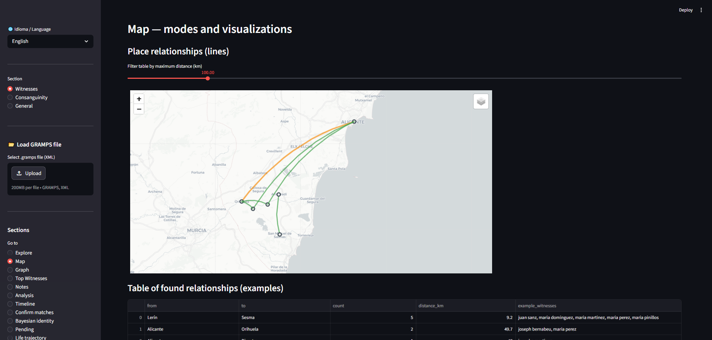
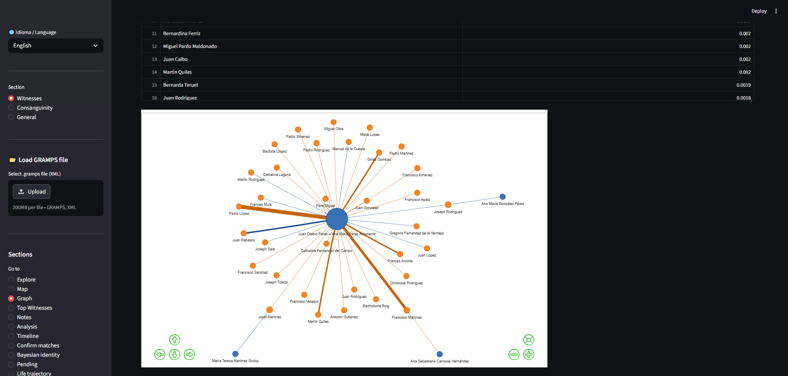

# Rayzes — Genealogical Analysis Platform

> *"Por sus rayzes e antigua descendencia es conocido."*

A web-based genealogical research platform for analyzing witness/godparent networks and consanguinity patterns in historical records. Built with Python and Streamlit, it processes GRAMPS XML database files and provides interactive visualizations, statistical analysis, and exportable reports.

---

## Table of Contents

- [Overview](#overview)
- [Modules](#modules)
  - [Testigos (Witness & Godparent Analysis)](#testigos-witness--godparent-analysis)
  - [Consanguinidad (Consanguinity & Inbreeding Analysis)](#consanguinidad-consanguinity--inbreeding-analysis)
  - [General (Tree Endpoints, Inconsistencies & Historical Context)](#general-tree-endpoints-inconsistencies--historical-context)
- [Getting Started](#getting-started)
- [Data Format](#data-format)
- [Tech Stack](#tech-stack)

---

## Overview

Rayzes is designed for genealogical researchers who need to go beyond basic family tree visualization. It is particularly useful for studying:

- **Compadrazgo networks**: Who were the godparents in a community, how often did they appear, and which families did they connect?
- **Genetic relatedness**: How inbred were historical populations, and which couples shared common ancestors?

The app requires a **GRAMPS XML file** (`.gramps`) as input, which you upload at startup. All analysis is performed in-browser with no backend server required.

A **language selector** (English / Spanish) is available at all times in the sidebar.

---

## Screenshots

| Map — Geographic connections | Social Network Graph |
|---|---|
|  |  |

| Top Witnesses | Confirm Identity Matches |
|---|---|
|  |  |

| Tree Endpoints | Interactive Pedigree | Historical Context |
|---|---|---|
|  |  |  |

---

## Modules

### Testigos (Witness & Godparent Analysis)

This module analyzes the role of witnesses and godparents (padrinos/madrinas) across baptism and marriage records. It includes 14 pages:

---

#### Explorar — Event Explorer

Search and filter the full event dataset. Filter by witness name, event type (baptism, marriage, etc.), location, and year range. Inspect individual records and see which witnesses appear in each event.

---

#### Mapa — Geographic Map

Visualize witness activity and migration on an interactive map. Supports **9 map modes**:

- **Hotspots**: Heatmap of event density by location
- **Connections**: Lines between places where the same witness appeared
- **Migrations**: Arrows indicating directional movement over time
- **By family**: Events grouped and colored by family surname
- **Timeline**: Animated map showing how activity shifted over the years
- **Clusters**: Geographic clustering of events
- **Radius**: Witness activity radius estimation
- **Comparison**: Side-by-side geographic comparison between witnesses
- **Influence zones**: Voronoi-based territory mapping per witness

---

#### Grafo — Social Network Graph

An interactive network graph where nodes are witnesses and edges represent co-appearances in events. Highlights:

- **Bridge witnesses**: People whose removal would disconnect parts of the network (high betweenness centrality)
- **Clusters**: Communities of witnesses that frequently collaborated
- Node sizing and coloring by event count or centrality score
- Filter by minimum edge weight or family

---

#### Superpadrinos — Top Witnesses

Ranks witnesses by total number of events. For each top witness, shows:

- Full event timeline
- Families they most commonly served
- Geographic reach
- Years active and longevity score
- Activity trend (increasing, decreasing, or stable)

---

#### Notas — Event Notes Browser

Browse and filter the notes attached to events in the GRAMPS database. Supports manual **category overrides** to reclassify notes. Categories include things like occupation references, health records, social status markers, and more.

---

#### Análisis — Statistical Analysis

A deep-dive analytics page covering:

- **Timeline analysis**: Events per year with trend lines
- **Family pattern analysis**: Which families used the same godparents repeatedly
- **Endogamy score**: How closed the witness network is (percentage of internal vs. external connections)
- **Surname timeline**: Track how family surnames appear and disappear as witnesses over generations
- **Birth order and prestige**: Correlation between a child's birth order and the social standing of their chosen godparent
- **Stability vs. mobility**: Geographic mobility index for each witness

---

#### Timeline — Chronological View

An interactive chronological strip showing witness activity across time. Zoom in to specific decades, filter by witness or family, and inspect individual events by hovering.

---

#### Confirmar coincidencias — Confirm Identity Matches

When the same person appears under slightly different name spellings, this page presents candidate pairs for user review. For each candidate pair, you can:

- **Confirm**: Mark two records as the same person
- **Reject**: Mark them as distinct
- Confirmations are saved persistently to `data/confirmed_links.json` and propagate throughout all other pages

---

#### Identidad bayesiana — Bayesian Identity Resolution

Uses a Bayesian scoring model to compute the probability that two witness records refer to the same individual. The score combines:

- **Name similarity** (fuzzy string matching via rapidfuzz + jellyfish)
- **Temporal overlap**: Are the active years compatible?
- **Geographic proximity**: How close were the events in space?
- **Family overlap**: Did they appear for the same families?

Results are ranked by probability. High-confidence matches can be confirmed directly from this page.

---

#### Pendientes — Pending Cases

Shows all witness records that have not yet been confirmed or rejected. Useful as a work queue to ensure no ambiguous identity cases go unresolved before exporting a final report.

---

#### Trayectoria vital — Life Trajectory

For a selected witness, reconstructs a probable life trajectory:

- Estimated birth and death year range
- Map of locations visited over their lifetime
- Events annotated on a personal timeline
- Family connections discovered through godparent appearances

---

#### Informe — Report Export

Generates a narrative report for a selected witness or the full dataset. Export formats include:

- **HTML**: Formatted printable document with embedded charts
- **Markdown**: Plain-text structured summary
- **JSON**: Machine-readable data export

Reports include event tables, geographic summaries, family connections, and network statistics.

---

#### Testigos en árbol — Witnesses in the Family Tree

Links witnesses from the event records back to named individuals in the GRAMPS family tree. Uses a scoring system that weighs:

- Name match quality
- Date compatibility
- Place overlap
- Existing confirmations

Shows matched individuals with their GRAMPS person ID and confidence score.

---

#### Posibles familiares — Possible Relatives by Surname Coincidence

Detects events where a confirmed witness shares a surname with the event subject, flagging them as possible relatives for further study. The scoring model accounts for:

- **Surname position**: paternal (1st) vs. maternal (2nd) surnames are weighted differently — in Spanish records witnesses can be grandparents or uncles, so the maternal surname of a witness may match the paternal surname of the subject
- **Surname frequency**: hyper-frequent surnames (García, López, Smith…) receive a penalty, reducing false positives
- **Presence in the GRAMPS tree**: witnesses found in the family tree receive a score boost; those with a confirmed kinship path receive a larger one
- **Fuzzy matching**: historical spelling variation is handled with an 82 % similarity threshold via rapidfuzz

**Surname systems supported** (selectable in the sidebar):

| Code | System | Key characteristic |
|------|--------|--------------------|
| `es` | Spanish | Two surnames, paternal + maternal (weight 1.0 / 0.75) |
| `pt` | Portuguese | Two surnames, historical maternal-paternal order |
| `en` | English / Anglo-Saxon | Single patrilineal surname |
| `fr` | French | Single surname with noble particles (de, du, de la…) |
| `de` | German / Dutch | Single surname with particles (von, van, zu…) |
| `it` | Italian | Single surname with particles (di, del, della…) |
| `ar` | Arabic | Patronymic chain (ibn/bint); compared by chain position |
| `ru` | Russian / Slavic | Gendered endings normalised to root for comparison |
| `zh` | Chinese / Korean / Vietnamese | Surname first; heavily penalised due to limited repertoire |

Results are presented across four tabs:

- **Candidate list**: full sortable table with surname, position, similarity score, confidence level, GRAMPS ID (when found in tree), and inferred kinship relationship
- **By witness**: aggregated view showing how many distinct families each witness shares a surname with, and their maximum confidence level
- **By surname**: aggregated view showing which surnames produce the most coincidences, useful for spotting dominant family networks
- **Review**: a work queue for confirming or discarding each candidate; decisions are saved persistently to `data/confirmed_links.json`

Confidence levels:

- 🟢 **High**: rare surname + positional match + witness found in tree
- 🟡 **Medium**: moderate surname + correct positional match
- 🟠 **Low**: frequent surname or secondary-position coincidence
- 🔴 **Very low**: hyper-frequent surname with no additional evidence

Results can be exported to CSV.

---

### Consanguinidad (Consanguinity & Inbreeding Analysis)

This module computes genetic relatedness metrics from the family tree. It parses the full pedigree from the GRAMPS file and runs graph-based algorithms to find relationships and inbreeding.

---

#### Inbreeding Coefficient (F)

Calculates the **Wright inbreeding coefficient (F)** for any individual in the tree. F measures the probability that both alleles at a random locus are identical by descent. The algorithm:

1. Builds a directed ancestor graph from the GRAMPS pedigree
2. Finds all paths between parents through common ancestors
3. Sums contributions from each common ancestor, weighted by path length and the ancestor's own F

Results are displayed per person with their ancestors' contribution breakdown.

---

#### Kinship Coefficient (Φ)

Computes the **kinship coefficient (Φ)** between any two selected individuals. Φ is the probability that a random allele drawn from each person is identical by descent. Φ is then converted to **coefficient of relationship (r)** for an intuitive relatedness percentage.

---

#### Relationship Classification

Given two individuals, the module classifies their relationship using both:

- **Kinship-based heuristics**: Φ thresholds for parent/child, full sibling, half-sibling, first cousin, etc.
- **Path distance heuristics**: Generational distance through the common ancestor graph

For complex pedigrees, both methods are shown and reconciled.

---

#### Consanguineous Couples

Scans all couples in the family tree and identifies pairs who are genetically related. For each consanguineous couple:

- Displays their kinship coefficient and relationship classification
- Shows the common ancestor(s) with full path
- Renders an interactive Pyvis graph of the connecting pedigree subgraph
- Sortable by F value, time period, or location

---

#### Common Ancestor Finder

Given two individuals, finds **all common ancestors** and the shortest paths through the pedigree connecting them. Results include:

- Ancestor name, GRAMPS ID, and birth/death dates
- Generation distance from each of the two individuals
- Contribution to total kinship

---

#### Pedigree Collapse Analysis

Identifies individuals who appear **more than once** in a pedigree (i.e., who are both paternal and maternal ancestors). This "pedigree collapse" is a direct consequence of consanguineous marriages in earlier generations. The page shows:

- Repeated ancestor list with frequency count
- Timeline of when pedigree collapse increased or decreased in the lineage

---

#### Interactive Pedigree Visualization

Three Pyvis-rendered interactive graph views:

- **Subtree view**: Expand an individual's ancestor tree up to N generations
- **Relationship view**: Show the pedigree subgraph connecting two specific people
- **Inbreeding colormap**: Color all individuals in the tree by their F value (gradient from white to red)

---

#### Historical Inbreeding Trends

A time-series chart of average inbreeding coefficient per generation or per decade, computed across all individuals with known birth years. Useful for identifying historical periods of increased endogamy.

---

#### Geographic Ancestor Distribution

Maps the birthplaces of an individual's ancestors across generations. Color-coded by generation depth, with lines connecting parent–child locations to reveal geographic origins and migration chains.

---

### General (Tree Endpoints, Inconsistencies & Historical Context)

This module provides three analytical sub-pages that work directly from the GRAMPS family tree data, focusing on data quality, temporal extremes, and historical enrichment.

---

#### Extremos del árbol — Tree Endpoints

Identifies the genealogical and chronological extremes of the tree:

- **Leaf nodes**: Individuals with no known parents, representing the current research frontier
- **Research feasibility**: For each leaf node, estimates how likely it is that further ancestors can be found, based on estimated parent birth year, known location, and available record coverage
- **Record date ranges**: Allows the user to define the available parish record coverage per place (stored persistently in `data/gen_record_dates.json`), so feasibility estimates reflect actual archival reality
- **Auto-fill from sources**: Extracts start dates for baptism, marriage, death, and confirmation registers directly from the GRAMPS sources, using a keyword-based classifier that recognises common title prefixes (LB, LM, LD, LC) as well as free-text equivalents in any language. Only fills empty fields; does not overwrite manually entered values
- **Parish browser**: An expandable panel lists all sacramental registers found in the sources for each location in the table — parish name, register type, and year range — so the user can see at a glance which parish to search when a location had more than one
- **Confirmation column**: Tracks earliest available confirmation records alongside baptism, marriage, and death
- **Birth year inference**: When a leaf individual has no recorded birth or baptism year, the system estimates it from the birth years of their oldest known children or grandchildren, using the tree's own parent-age statistics
- **Birth place inference**: When no birth place is recorded, the most frequent birth/baptism place among the individual's children is used as a working hypothesis (clearly labelled in the table)
- **Column order persistence**: The column arrangement in the leaf table is preserved across saves
- **Ancestor highlighting**: A reference person selector lets the user choose any individual in the tree; their direct ancestors and siblings of those ancestors are highlighted in red in both the feasibility summary tables

---

#### Inconsistencias — Data Inconsistency Detector

Automatically scans the entire family tree for logical and biological inconsistencies, grouped into four categories:

**A — Problematic Children**
- Siblings born less than 9 months apart
- Possible twin births (same year, not annotated as twins in notes)
- Parent too old at time of child's birth (relative to P95 of the tree)
- Child born before parent

**B — Marriage Anomalies**
- Marriage at an unusually young age (below tree's own P5)
- Marriage at an unusually advanced age (above tree's own P95)
- Extreme age gap between spouses (>30 years)

**C — Chronological Inconsistencies**
- Death year before birth year
- Dates set in the future (after the current year)
- Marriage recorded before a spouse's birth
- Posthumous child (born more than 1 year after father's death)
- Premarital birth (born more than 1 year before parents' marriage)

**D — Biological Impossibilities**
- Duplicate events (two recorded births or two deaths for the same person)
- Circular ancestry (a person appears as their own ancestor in the pedigree graph)

Detection thresholds are derived automatically from the tree's own statistics (P5/P95 percentiles for marriage and parenthood ages), so the analysis adapts to the demographic profile of each dataset.

Each inconsistency is classified with a severity level: **error** (biological impossibility), **warning** (statistically anomalous), or **info** (plausible but noteworthy).

**Dismissal system**: Any inconsistency can be individually dismissed — marked as a known false positive that should not reappear in future sessions. Dismissed items are stored persistently in `data/dismissed_inconsistencies.json` and are shown in a collapsible section at the bottom of the page, where they can be restored at any time. The CSV export only includes active (non-dismissed) inconsistencies.

---

#### Contexto histórico — Historical Context

Enriches genealogical research by linking the life events of individuals and families to the historical events of the municipalities where they lived.

**Place management tab:**

Upload a JSON file containing historical events for any municipality present in the tree. Each file follows a simple structure:

```json
{
  "place": "Orihuela",
  "events": [
    { "year": 1521, "month": null, "description": "Germania revolt." },
    { "year": 1648, "month": 6, "description": "Plague epidemic." }
  ]
}
```

- `year`: event year (required)
- `month`: event month, 1–12 (optional)
- `description`: free-text description (required)

Uploading a new file for a place that already has data **merges** the events rather than replacing them: new events are appended and exact duplicates (same year and description) are discarded. The merged set is re-sorted chronologically. To start from scratch, use the delete button for that place before uploading.

The management panel lists all municipalities extracted from the tree, showing how many historical events are loaded for each and providing a delete button to remove data for a specific place.

**Timeline tab:**

Select an individual or a family from the tree. The app automatically identifies which loaded municipalities are linked to that person or family (from their birth, baptism, marriage, death, and children's events) and builds a chronological timeline interleaving:

- 🔵 **Personal events**: birth, baptism, marriage, birth of each child, death, and any other recorded events
- 📜 **Historical events**: events from the matched municipalities

For each historical event, if the individual has a known birth year, the approximate age at the time of the event is shown inline — e.g. *"Luis López was ~11 years old when this happened"*.

The timeline is scoped to a relevant window: it starts **10 years before the individual's birth** (to provide contextual lead-in) and ends at the last recorded personal event. Historical events outside this window are omitted.

The full timeline can be exported to CSV.

---

## Getting Started

### Requirements

- Python 3.10+ (3.10 or 3.11 recommended — required by pinned dependencies such as `numpy==1.26.4` and `pandas==2.2.1`)
- pip

### Installation

```bash
git clone https://github.com/funkytrain/Rayzes.git
cd Rayzes
```

Create and activate a virtual environment:

```bash
# macOS / Linux
python -m venv venv
source venv/bin/activate

# Windows
python -m venv venv
venv\Scripts\activate
```

Install dependencies:

```bash
pip install -r requirements.txt
```

> **Note on PDF export:** The `pdfkit` package (used by the Consanguinity report exporter) requires **wkhtmltopdf** to be installed at the OS level. Without it, PDF export will fail but all other features work normally.
> - **Windows:** Download the installer from [wkhtmltopdf.org](https://wkhtmltopdf.org/downloads.html) and add it to your PATH.
> - **macOS:** `brew install wkhtmltopdf`
> - **Linux:** `sudo apt install wkhtmltopdf`

### Running the App

```bash
streamlit run main.py
```

Open your browser at `http://localhost:8501`.

On startup, you will be prompted to upload a `.gramps` file. This is the standard export format from the [GRAMPS genealogy application](https://gramps-project.org/).

### Persistent Data

The following files in `data/` are created and updated automatically as you use the app:

| File | Purpose |
|---|---|
| `confirmed_links.json` | Confirmed/rejected witness identity matches |
| `note_category_overrides.json` | Manual note category reclassifications |
| `gen_record_dates.json` | User-defined civil/parish record coverage ranges per place |
| `dismissed_inconsistencies.json` | Inconsistencies manually dismissed as false positives |
| `historical/<place>.json` | Historical events uploaded per municipality for the Historical Context sub-page |

These files persist between sessions. Back them up if you want to preserve your review work.

---

## Data Format

Rayzes reads **GRAMPS XML files** (`.gramps` extension). This is the native export format of [GRAMPS](https://gramps-project.org/), a free and open-source genealogy program. To export from GRAMPS:

1. Open your database in GRAMPS
2. Go to **Family Trees → Export**
3. Choose **GRAMPS XML** as the format
4. Save the `.gramps` file and upload it to Rayzes

The app expects the file to contain people, families, events, and places. Witness references in events (roles: witness, godfather, godmother) are the primary data source for the Testigos module.

---

## Tech Stack

| Layer | Libraries |
|---|---|
| Web UI | Streamlit |
| Data processing | pandas, numpy |
| XML parsing | lxml |
| Graph analysis | networkx, pyvis |
| Geographic maps | folium, streamlit-folium |
| Fuzzy matching | rapidfuzz, jellyfish |
| Clustering | scikit-learn |
| Visualization | plotly, matplotlib, seaborn |
| Scientific computing | scipy |
| Report templating | Jinja2, pdfkit |
